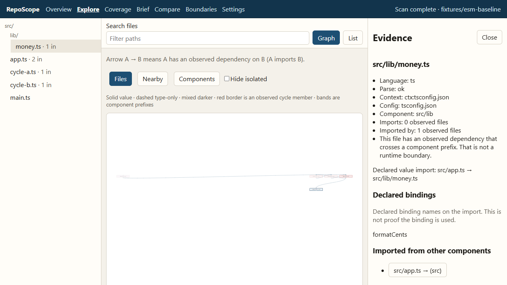

# RepoScope

RepoScope reports observed source-level dependencies in TypeScript, JavaScript, Python, Java, and Kotlin. A Python, Java, or Kotlin edge is a declared import resolved under the selected project configuration. It is not a runtime import and not a symbol-level use.

It turns those imports into an evidence-linked dependency graph so you can ask: **what depends on this file, and what evidence should I inspect before changing it?**

It reports **observed dependencies** and a **potential investigation scope**. It does not claim that a change will break N files, prove dead code, or predict runtime failures.



## 90-second demo

1. `npm ci && npm run build && npm run demo`
2. Scan `fixtures/esm-baseline`.
3. Select `src/lib/money.ts`. Direct importer is `src/app.ts`. Shortest observed path: `src/main.ts → src/app.ts → src/lib/money.ts`.
4. Open the import statement and the content hash. Evidence is current, stale, or unavailable after a hash check.
5. Note the `app` / `cycle-a` / `cycle-b` cycle group. A cycle is an observed strongly connected set, not automatically a defect.
6. Compare with `fixtures/esm-revised`. The added observed dependency is `src/lib/money.ts → src/main.ts`.
7. Open `fixtures/unresolved-import` to see coverage for a specifier that is not resolved under this configuration.

```
npm ci
npm run verify
npm run demo
```

`GET /api/health` and other API routes require `Authorization: Bearer <token>`. The CLI passes the token in the URL fragment and does not print it.

## Setup

- Node.js **24.21.0** Active LTS and npm **11.19.0**
- `npm ci`
- `npm run build`
- `npm run demo` or `npx reposcope inspect [path]`

Pinned versions: [`docs/versions.md`](docs/versions.md).

## Inspect your own repository

```
npm run build
npx reposcope inspect path/to/your/repo
npx reposcope inspect https://github.com/owner/repo
```

A GitHub link is cloned into `~/.reposcope/clones` (or `REPOSCOPE_CACHE`) with hooks disabled, then scanned locally. RepoScope does not install that project's packages or run its scripts. The browser may submit a `github.com` locator; it still cannot submit filesystem paths. Default snapshot exports omit source text and absolute paths.

## Commands

| Command | Purpose |
| --- | --- |
| `npx reposcope inspect [path|github-url] [--demo] [--port 8787] [--reopen] [--commit rev]` | Loopback investigation UI. Default port 8787; `--reopen` attaches to a living session without printing the token. Does not hop ports. |
| `npx reposcope scan [path|github-url] [--demo] [--out file] [--commit rev]` | Source-free snapshot JSON |
| `npx reposcope brief [path|github-url] [--demo] [--out file] [--full] [--libraries] [--commit rev]` | Your-code investigation brief; `--full` is complete adjacency; `--libraries` is the specifier catalog |
| `npx reposcope compare a.json b.json` | Structural snapshot diff |
| `npm run demo` | Inspect bundled `fixtures/esm-baseline` |
| `npm run verify` | typecheck, lint, build, unit/integration, Playwright |

## What it does

- Scans a CLI-selected local root (read-only).
- Extracts static ESM imports, re-exports, and string `require()` with `typescript@6.0.3` compiler-API resolution.
- Builds a file-level graph of observed dependencies. Arrow `A → B` means A imports B. Declared binding names are optional metadata, not usage proof. Directory and workspace-package prefixes roll up into a component view of the same observed edges.
- Shows reverse impact, cycle groups, coverage omissions, hubs, and hash-checked evidence.
- Emits a compact investigation brief (Overview **Copy brief**, `/brief`, or `reposcope brief`) so a separately chosen assistant can start from observed edges instead of rereading the tree. Your-code and Libraries are separate lenses. RepoScope does not call a model.
- Resolves workspace `package.json` names to inventoried source via JSON `exports` / entry fields. It does not install that project's packages.
- Compares two source-free snapshots. Incremental rescans reuse unchanged files by content hash.
- Optional Git commit scans via `git ls-tree` / `git cat-file` (no checkout). JSON boundary policy evaluation.
- Persists source-free snapshots under `~/.reposcope/store` (or `REPOSCOPE_CACHE`), capped at 20 per repository identity. GitHub clones are pruned to the eight most recent. Open a snapshot file in the local editor without sending a filesystem path from the browser.
- Records stylesheet and other asset specifiers as unsupported, catalogs `package.json` names without installing them, classifies `node:` builtins and remote protocols, and optionally includes string `import()`.

## What it does not do

- Call a language model, embeddings API, or remote analysis service.
- Execute inspected project code or install that project's packages.
- Follow symlinks by default or accept filesystem paths from the browser.
- Treat type-only imports as value graph edges unless you opt in.

## Privacy

Bind is `127.0.0.1` only. Host and Origin are validated. Default exports omit source text and absolute paths. The investigation brief lists repository paths; pasting it into a cloud assistant leaves this machine. Private repositories are local-only; do not publish their snapshots.

## Package

Version **0.11.0**. The workspace is the supported distribution. `license` is MIT, `bin` is `reposcope`, and published packages expose `dist` only. `node scripts/build-release.mjs` writes `release/reposcope.exe` plus the web assets and fixtures beside it. The npm name `reposcope` is already taken, so this repository does not publish that name. `REPOSCOPE_PERSIST=0` disables the application snapshot cache.

Install the optional VS Code command from `extensions/vscode` if you want `RepoScope: Reveal File` in the editor. The loopback API still confines the path before launching `code` or `REPOSCOPE_EDITOR`.

## License

MIT. See [`LICENSE`](LICENSE).

## Contributing

See [`CONTRIBUTING.md`](CONTRIBUTING.md) and [`CODE_OF_CONDUCT.md`](CODE_OF_CONDUCT.md). Security reports: [`SECURITY.md`](SECURITY.md).

## Credits

RepoScope uses the TypeScript compiler API, React Flow (`@xyflow/react`), Fastify, Vite, Vitest, and Playwright. The original contribution is the analysis model, evidence and coverage semantics, local safety boundary, investigation workflow, and verification.
